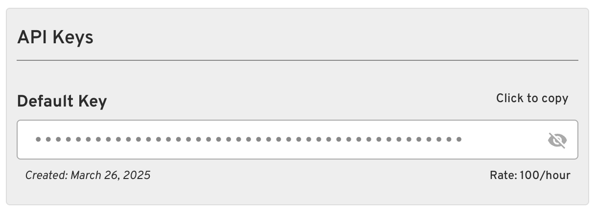

# Tango API

This repository is mostly dedicated to tracking **issues** (bugs, feature requests, questions, and general feedback) for Tango. You can use this space to report problems, request features, or ask questions.

[](https://tango.makegov.com/)
[](https://staging-tango.makegov.com/)

View our [CHANGELOG](./CHANGELOG.md)

---

## Table of Contents

- [Tango API Usage](#tango-api-usage)
- [Tango Issues Tracker](#tango-issues-tracker)
  - [Table of Contents](#table-of-contents)
  - [Purpose](#purpose)
  - [How to Use](#how-to-use)
    - [Submitting a Bug Report](#submitting-a-bug-report)
    - [Requesting a Feature](#requesting-a-feature)
    - [Asking a Question](#asking-a-question)
  - [Issue Templates](#issue-templates)
  - [Contributing](#contributing)

---

## Tango API Usage

### API Authentication

To use the [Tango API](https://tango.makegov.com/api/), you'll need to authenticate your requests using an API key. Here's how to get started:

#### Getting Your API Key

1. Log in to your [Tango](https://tango.makegov.com/) account
2. Visit your [profile page](https://tango.makegov.com/accounts/profile/)
3. Your API key will be displayed on this page:
  


#### Using Your API Key

To authenticate your API requests, include your API key in the request headers using the `X-API-Key` header:

  ```bash
  curl -H "X-API-Key: your_api_key_here" https://tango.makegov.com/api/api-keys/
  ```

#### Example Requests

##### Python (using `requests`)

  ```python
  import requests

  headers = {
      "X-API-Key": "your_api_key_here"
  }

  response = requests.get(
      "https://tango.makegov.com/api/api-keys/",
      headers=headers
  )
  ```

##### JavaScript (using `fetch`)

  ```javascript
  const headers = {
      "X-API-Key": "your_api_key_here"
  };

  fetch("https://tango.makegov.com/api/api-keys/", {
      headers: headers
  })
      .then(response => response.json())
      .then(data => console.log(data));
  ```

#### Security Best Practices

1. Keep your API key secure and never share it publicly
2. Don't commit your API key to version control
3. If you suspect your key has been compromised, contact us immediately to generate a new one
4. Use environment variables to store your API key in applications

#### Need Help?

If you're having trouble with API authentication, please contact our support team for assistance: [tango@makegov.com](tango@makegov.com).

---

## Tango Issues Tracker

### Purpose

This repository is publicly accessible for users to submit:

- Bug reports
- Feature requests
- Questions
- General feedback

Please note that this repository does not contain any code or project files. It is solely for logging and tracking issues. The main project repository is private, but issues raised here will be addressed promptly.

---

## How to Use

### Submitting a Bug Report

If you've encountered a bug, please [open a new issue](https://github.com/makegov/tango-public/issues/new/choose) and provide as much information as possible. This includes:

- A clear description of the bug.
- Steps to reproduce it.
- Expected behavior and actual behavior.
- Screenshots, if applicable.

### Requesting a Feature

To request a new feature, go to the [Feature Request](https://github.com/makegov/tango-public/issues/new/choose) template and describe the improvement or new functionality you'd like to see.

### Asking a Question

If you have a question about Tango, you can open an issue using the [Question Template](https://github.com/makegov/tango-public/issues/new/choose). Our team will respond as soon as possible.

---

## Issue Templates

To streamline issue submissions, we have provided several templates for common cases:

- **Bug Report**
- **Feature Request**
- **Question**
- **General Feedback**

Please select the appropriate template when submitting your issue.

---

## Contributing

We encourage contributions in the form of feedback, bug reports, and feature requests. Please adhere to the following guidelines:

- Be clear and concise in your descriptions.
- Provide relevant context to help us address the issue.
- For more significant contributions, feel free to discuss your idea in an issue first.
